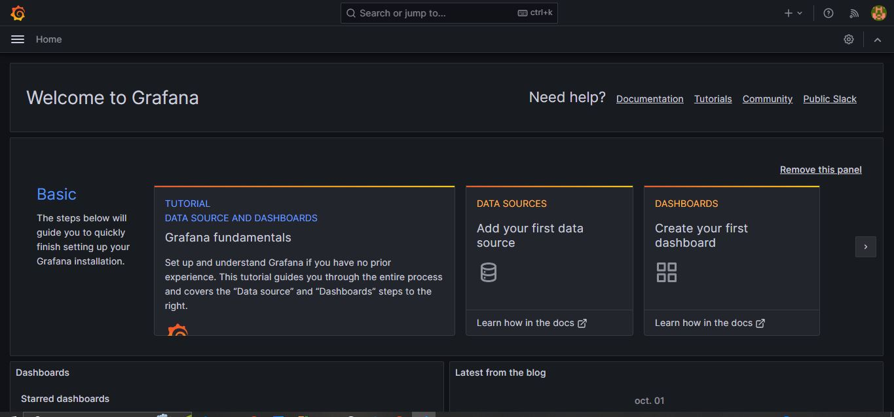
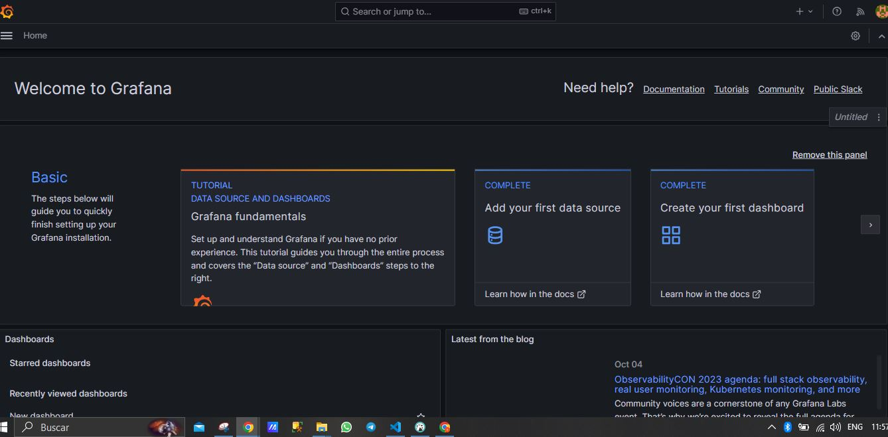
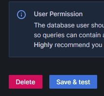

# Conferencia Grafana


## Crear BackEnd (simulando un envio de datos desde sensores a MySql)

- Ingresar a directorio  [Back](./Back/)
  - [Index.js](./Back/index.js)
    - Menu para interactuar con la app
    - Archivo inicial [Index.js](./Back/index.js), muestra un menu en consola para ejectuar la carga de datos "Ejecutar: ```node index.js```".
  - 
    - 1. carga datos en forma de una linea recta creciente, en las tablas ```SensorA``` y ```SensorB```
      - esta opcion sirve para mostrar como crear una frafica en grafana
    - 2. Carga datos de manera aleatoria para evidenciar la diferencia entre la primer y la segunda carga de datos. 
    - 3. limpiar el contenido de las tablas de datos en ```MySql```
---
---

## Instalacion en Windows.

- Descarga (Recomendacion descargar "```Standlone Windows Binaries```"):
    -  

    - https://grafana.com/grafana/download?platform=windows

- Descomprimir el archivo descargado
  - 
- Para iniciar, ingresar a la ruta:
  - ```./grafana-10.1.4/bin```
- Al ingresar a la ruta se econtraran los siguientes archivos
  - 
- Ejecutar el archivo "```grafana-server.exe```", desde linea de comandos.
  - "```./grafana-server.exe```"
  - Nota: seleccionar ```aceptar``` en la ventana emergente.
- Comprobar funcionamiento:
  - Abrir un navegador e ingresar a:
    - http://localhost:3000/login
    - 
- Para ingresar al sistema, usar las credenciales, por defecto:
    - username:
      - ```admin```
    - password:
      - ```admin``` 

- Al ingresar con credenciales por defecto, Grafana solicita realizar un cambio de contraseña
   - 

- Ingreso exitoso:
  - 
  


## Conneccion de Grafana con MySql
- Ingresamos a ```Add your first data source```
  - 
- Buscamos ```MySql```
  - 
- ingresamos las credenciales de la base de datos.
  - 
- seleccionamos ```Save and Test```
  - 
- Muestra mensaje de coneccion exitosa
  - 

## Crear Dashboard

- ingresamos a ```create your first dashboard```
  - 
  - seleccionamos ```Add visualization```
  - 
  - seleccionamos ```MySQL-1```
  - 
  - Aparece
  - 
